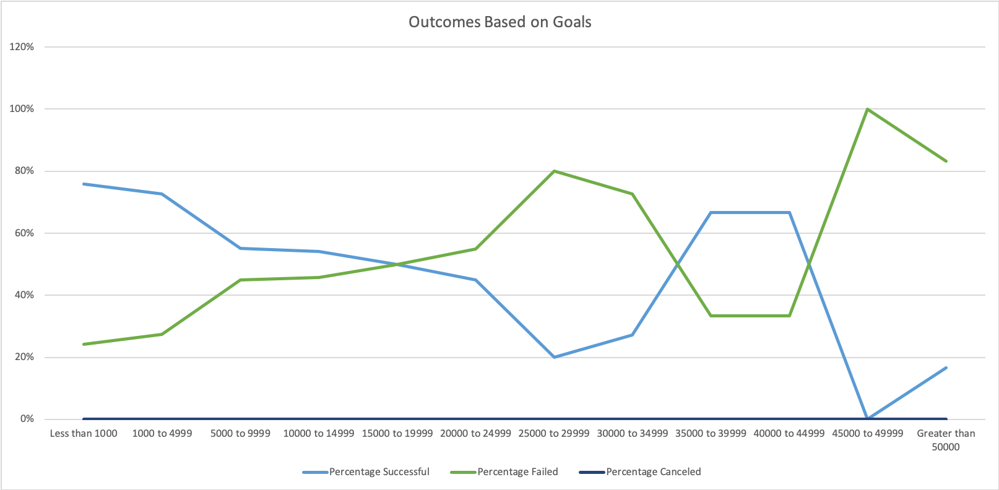
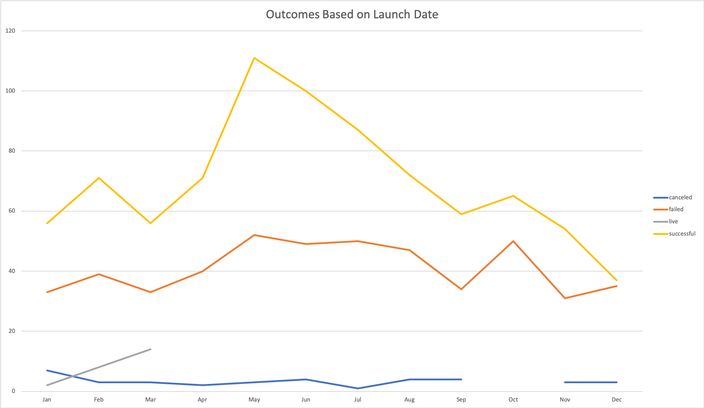

# UCB_Lesson_1 -An Analysis of Kickstarter Campaigns
Kickstarter analysis
### Challenge
The following are my results for the homework challenge to demonstrate how **goals** and **launch date** affect the outcome of Kickstarter campaigns. The analysis is documented in the Excel spreadsheet titled, `Lesson1HW.`

###### Table of Contents
* Tools/Technology
* Charts
* Conclusions
* Limitations

###### Tools/Technology
Microsoft Excel was used to understand the affect that goals and launch date have on the outcome of Kickstarter campaigns. Specifically, to determine the affect goals may have on the outcome of a Kickstarter campaign, the COUNTIFS function was used. To determine the affect launch date may have on the outcome of Kickstarter campaigns, a PivotChart was used.

###### Charts
The following section has two line charts. The first line chart depicts the outcome of Kickstarter campaigns based on the goal amount. The goal amounts were split into 12 groups per the instructions provided in the assignment. The second line chart depicts the outcome of Kickstarter campaigns based on the launch date of the campaign. 

###### Conclusions
Based on the analysis performed, in general, plays have a higher likelihood of having a successful Kickstarter campaign if the fundraising goal is under $20,000 with the greatest percentage of success happening in Kickstarter campaigns with goals under $5,000. While there have been Kickstarter campaigns that have been unsuccessful for plays, none have been canceled. While not impossible, there is less than a 1% chance of successfully funding Kickstarter campaigns if the goal is greater than or equal to $40,000. 

When analyzing the outcomes of Kickstarter campaigns based on the launch date, it is clear that Kickstarter campaigns launched in May have the highest likelihood of success. After May, the rate of success declines until September, but does not reach the peak witnessed in May again. Additionally, when reviewing the outcomes of Kickstarter campaigns based on launched date, we can see that 37 campaigns were cancelled. Since we know from the prior chart that no plays were cancelled, the cancelled camplaigns were likely associated with the other two subcategories in the "theater" parent category.

###### Limitations
It is important to note that the population represented in the two charts are not equivalent. In the "Outcomes Based on Goals" chart, we are examining a subset (or subcategory) of the "theater" parent category. In the "Outcomes Based on Launch Date" chart, we are examining the entire "theater" parent category which contains three subcategories, including musicals, plays, and spaces. 

In addition to examining the outcome of Kickstarter campaigns based on launch dates, I would recommend further analysis to see if there is a correlation between the duration of a Kickstarter campaign (i.e. the time between the start and end of a campaign) and its success. 
